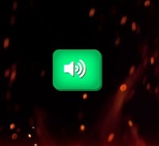

# Rochambeau v2.0

From the Tao came One, and from the One came Two. From the Two, there came Three: The Rock, The Paper, and the Scissors, and glorious, fiery combat immediately ensued. This eternal struggle for supremacy has since intensified with the appearance of two new challengers: a lizard, and Spock from Star Trek. 

From whence did these mysterious opponents come? What is Tao?, What kind of lizard is lizard?, How is a piece of paper or a tiny lizard any match for Spock from Star Trek?, Are you sure you're getting enough sleep, Chris? - All of these questions, and many more, will <em>not</em> be answered, in ROCHAMBEAU V2.0.

ROCHAMBEAU V2.0 is an interactive webpage that enables you to play a pulse-pounding game of Rock, Paper, Scissors, Lizard, Spock against an unpredictable computer opponent.

It is intended to be humorously extreme and epic, as well to graphically resemble a wrestling promotion, and to play similarly to a fighting videogame.

## Technologies used
<ul>
    <li>Hypertext Markup Language (HTML)</li>
    <li>Cascading Style Sheets (CSS)</li>
    <li>JavaScript</li>
    <li>Markdown</li>
    <li>GitHub</li>
    <li>GitPod</li>
    <li>Git</li>
</ul>

## Features

### Existing Features

Upon loading the page, the visitor will be presented with a large modal button. This button can be interacted with by clicking it, or by pressing the Enter key. As the text on this button suggests, interacting with it will begin the game:

Once the modal button is clicked, one of the elements that will immediately stand out, despite being small, is the sound button. Right away, the visitor will notice that the page features a lot of audio. This button provides a quick, one-click way for them to mute the page if they want to.

Also when the button is clicked, an announcer will audibly prompt the player to select a character from the left hand column, which briefly flashes green to draw the player's attention.

Note that on devices with smaller screen dimensions, the page will automatically scroll to the top of the character column to more fully display its contents.

Hovering over your character of choice will trigger a small animation, play audio, and highlight it, and clicking it will cause the highlighting to turn green. At this point, selection of characters is temporarily disabled.

Once the player has selected their character, there is a short delay to create suspense, and then the computer makes its choice. The same animation and sound is triggered for the character it selects. The two selected characters appear in the discs in the centre element, and both discs light up.

When the characters populate the discs, an auto-scroll is triggered on devices with smaller screens.

The names of the selected characters appear in the plaques below the discs, and after a moment, the light around disc in which the winning character is set turns green to indicate that said character has won.

Next, one of the lights on the scoreboard will light up depending on who won, not unlike a fighting videogame. The lights on the left indicate rounds won by the player, and the lights on the right represent the same for the computer. 

On devices with different screen dimensions, an automatic scroll will also happen at this point to briefly show the change to the scoreboard, before scrolling back up to the characters.

After a moment, the game screen resets, and the player is asked to select their character again. There can be a maximum of 3 rounds, and a minimum of 2, again, just like in most fighting videogames.

When the player or the computer is about to win their second round, the character they select will perform its finishing move. The announcer declares this, and the name of the move is briefly displayed in a small blue text box. A unique sound effect plays for each move, and each is accompanied by a screen shake.

The match-winning character's disc glows gold, while the match-losing character's portrait darkens. Depending on whether the player or the computer wins the match, a different sound effect is played.

Finally, another modal button appears. The text on this button reads "Play Again" rather than "Begin Game".

### Features yet to be implemented

<strong>Character speech bubbles</strong>: I had wanted to make these appear when a character was selected, and to possibly have them contain different text depending on whether the character was selected by the player or the computer. This was a low-priority feature though, as although I had some funny ideas for it, I felt that it might be too much on top of everything else. I felt that there would be too many things competing for the player's attention, not to mention that these speech bubbles probably wouldn't display for long, unless I wanted to interrupt the flow of the game even more. Moreover, the testing process was time-consuming enough without this feature.

<strong>Character health meters</strong>: This was an idea that popped into my head very late on, and which I would like to add someday. I didn't feel like I had the time to implement it well.

<strong>Different finishing moves</strong>: I either wanted to have the computer use different finishing moves to the player, or I wanted to give the player a choice of two finishing moves per character (and have the computer randomly select from the 2 available to each character). I feel this would have added a layer of fun to the game, but as with the speech bubbles, I was concerned that it would make testing an even lengthier process.

<strong>Secret character(s)</strong>: I considered adding a secret character that wins against all 5 of the other characters, but I never really gave any serious thought to how I would implement it in the game. I initially had a vague idea about having the character click a specific, hidden point on the body element to select the character, but I wasn't too enthusiastic about it. I didn't give this feature all that much thought, and so no interesting ideas for how to implement it ever popped into my head.

<strong>Network play</strong>: This feature is almost certainly beyond my ability to implement at this stage in the course, and perhaps will still be if and when I complete it, but I would like to add a multiplayer mode to the game someday. It would of course only work if the two players couldn't see and hear one another's computers / laptops / phones, and if one player made their choice before the other one, it would have to be invisible to their opponent until they had made their choice too. 

## Testing

<em>Please refer to TEST.md.</em>

## Deployment

The process followed in order to deploy this project to GitHub Pages was as follows:
<ol>
    <li>I navigated to GitHub.com and logged in to my account.</li>
    <li>Once I was logged in, I navigated to the repository for this project.</li>
    <li>At the page for the project repository, I entered the Settings menu.</li>
    <li>In the Settings menu, I clicked on the Pages section in the left-hand pane.</li>
    <li>In the Pages section, I left the Source drop-down menu set to "Deploy from a branch".</li>
    <li>For Branch, I selected "main".</li>
    <li>Finally, I clicked Save. After a few moments, the URL for my project went live. Please find it below.</li>
</ol>

Live link to this project: 

## Credits

### Code

### Media
